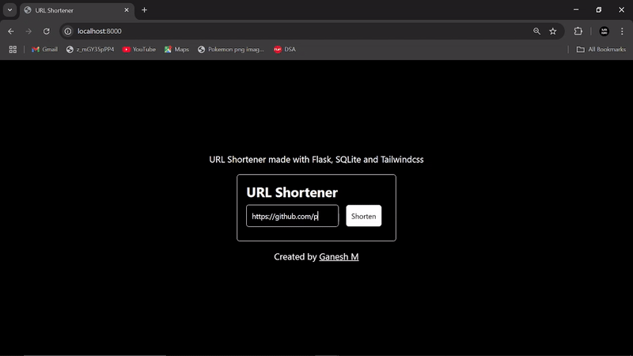

<h1 align="center" id="title">URL Shortener</h1>

<p align="center"></p>

<p id="description">A simple full-stack URL shortener built with Flask SQLite TailwindCSS and JavaScript.</p>

<p align="center">

<h2>🚀 Demo</h2>

 
  
<h2>🧐 Features</h2>

Here're some of the project's best features:

*   Shorten URLs – Convert long URLs into short easy-to-share links.
*   Redirect to Original URL – Access the original URL using the short link.
*   Database Storage – Uses SQLite to store URLs and their short IDs.
*   Persistent URLs – Shortened URLs remain valid even after restarting the server.
*   Fast & Lightweight – Minimal dependencies for quick performance.

<h2>🛠️ Installation Steps:</h2>

<p>1. Clone the Repository</p>

```
git clone https://github.com/prodev717/url-shortener
```

<p>2. Navigate to the cloned directory</p>

```
cd url-shortener
```

<p>3. Install Required Dependencies</p>

```
pip install -r requirements.txt
```

<p>5. Run main.py</p>

```
python main.py
```
<p>6. Open http://localhost:8000 in browser.</p>

<h2>🍰 Contribution Guidelines:</h2>

To contribute first fork the repository and clone it to your local machine. Create a new branch for your changes then make and test your modifications while following the project's coding style. Commit your changes with a clear message and push your branch to your fork. Afterward create a pull request with a description of your changes. Once it’s reviewed it will be merged.
  
<h2>💻 Built with</h2>

Technologies used in the project:

*   python
*   SQLite
*   flask
*   html
*   tailwind CSS
*   JavaScript

<h2>🛡️ License:</h2>

This project is licensed under the MIT License
